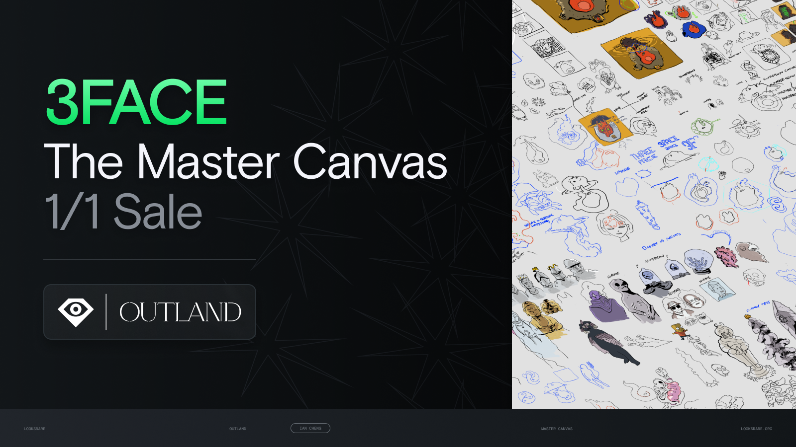
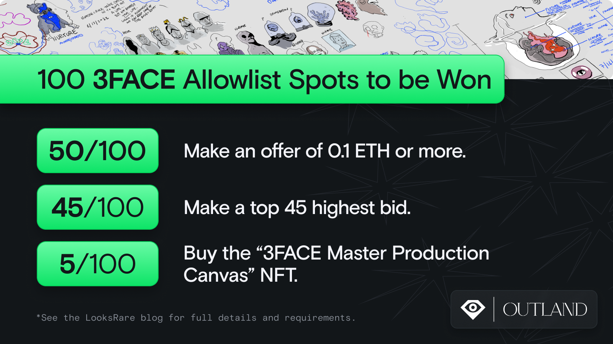

LooksRare is collaborating with Outland Art and artist, Ian Cheng to host an exclusive event prior to the launch of Ian’s new project, 3FACE.

As LooksRare does not currently have an auction feature, we’re getting creative. You can think of this as some kind of offer auction - basically, the highest offer will be accepted at the end of the event period.

## Overview

- Ian has minted a 1/1 NFT - [3FACE Master Production Canvas](https://looksrare.org/collections/0x9f1832783630DBae501e37dFfe4e3486aF66D8be/1).
- Starting from 1:00pm UTC on August 23rd, place an offer of 0.1 ETH or more for a chance to win an allowlist spot for the 3FACE mint.
- At a random time between 1:00pm - 2:00pm UTC on August 24, Ian will accept the highest offer, which will mark the end of the event.

## 100 3FACE Allowlist Spots to be Won

- The buyer of the “3FACE Master Production Canvas” NFT will receive 5 **allowlist spots** for the 3FACE mint.
- The **45 highest valid offers** at the block # that the sale occurs will each receive 1 allowlist spot for the 3FACE mint.
- Place an offer of 0.1 ETH or higher at any time during the event period for a chance to win 1 of **50 allowlist spots** for the 3FACE mint.

## Things to Note

- The 50 winners of the allowlist spots for placing an offer of 0.1 ETH or over will be drawn at random.
- A maximum of 1 allowlist spot can be won per unique wallet address (not including the buyer of the “3FACE Master Production Canvas” NFT).
- Offers submitted via API are not eligible to participate.
- Wallets that had their first transaction after [block #15388672](https://etherscan.io/block/15388672) (6:21am UTC on August 22nd) are not eligible to participate.

## 3FACE Mint Details

[Learn more about 3FACE here.](https://outland.art/ian-cheng-nft-3face/)

The official mint site is https://outland.art/3face/

Total collection size - **4,096**

**Mint schedule**

- August 25, 2022: Allowlist - 0.2E
- August 26, 2022: Mintpass (E[lemental by Fang Lijun non 1/1](https://looksrare.org/collections/0xC9677Cd8e9652F1b1aaDd3429769b0Ef8D7A0425)) - 0.1E
- August 27, 2022: Public sale - 0.5E

## How will I know if I won?

All winners of the allowlist spots will be announced via [LooksRare’s official Twitter account](https://twitter.com/LooksRare) within 24 hours of the event ending.

### About Outland

Outland is a new platform dedicated to fostering critical conversations around emerging digital technologies and their connections to contemporary art. We aim to present insightful perspectives on a future-facing art world.

Outland is building a network of the leading voices in the creation, criticism, and collecting of digital art. Our web is constantly expanding through partnerships with museums, galleries, and other institutions, as well as through our commissions of art and writing.

### About Ian Cheng

Ian Cheng (born Los Angeles, 1984) is an artist living and working in New York. He has exhibited widely including solo presentations at MoMA PS1, New York; Serpentine Galleries, London; Leeum Museum of Art, Seoul; The Shed, New York; LUMA Foundation, Arles; Carnegie Museum of Art, Pittsburgh; Fondazione Sandretto Re Rebaudengo, Turin; Julia Stoschek Collection, Berlin; and group presentations at Venice Biennale, Venice; De Young Museum, San Francisco; Moderna Museet, Stockholm; Museum of Modern Art, New York; Whitney Museum of American Art; New York; Hirshhorn Museum; Washington DC; Tate Modern, London; Louisiana Museum, Copenhagen; Fondation Louis Vuitton, Paris; Sculpture Center, New York.

Since 2012, Cheng has produced a series of simulations exploring an agent’s capacity to deal with an ever-changing environment. These works culminated in the Emissaries trilogy, which introduced a narrative agent whose motivation to enact a story was set into conflict with the open-ended chaos of the simulation. Most recently, he has developed BOB (Bag of Beliefs), an AI creature whose personality, body, and life story evolve across exhibitions, what Cheng calls “art with a nervous system.”

---
