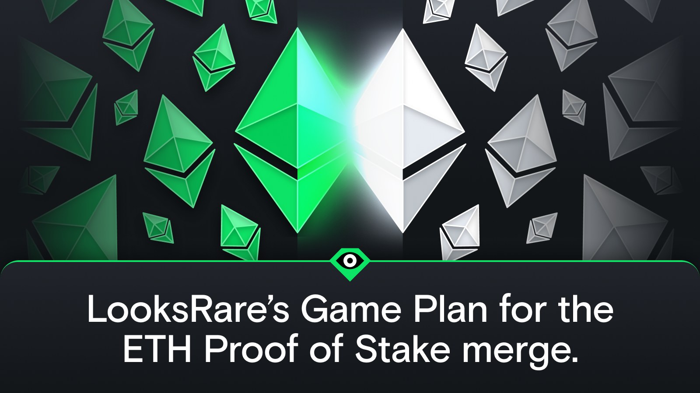

As a chain-split is now likely to occur on Ethereum post Merge, with POS/POW going their separate ways, it’s time to share the risk mitigation policy we previously laid out back in April, in a little more detail.

## Shortly before the merge occurs

1. LooksRare.org will go into “maintenance mode”
2. The multi-sig that currently operates the LooksRare protocol will update the Currency Manager so that WETH is no longer a supported currency. In doing this, no trades will be able to occur, negating any risk that orders could be replayed once the Merge is completed.

## After the merge is completed

1. The multi-sig operators will confirm that the POW fork is no longer using ChainID 1
2. The multi-sig will update Currency Manager on the POS chain to add WETH as a supported currency
3. LooksRare.org will be taken out of “maintenance mode”
4. Done!

## Are there any risks?

It is a known issue that orders on the POS/POW chain can be replayed on LooksRare’s contracts, as they (along with many others) use chainID as 1 for the EIP712 domain.

The domain separator was computed dynamically at the protocol deployment (with chainId = 1 for Ethereum mainnet) but hardcoded at deployment. Although the PoW chain has a different chainId than the PoS chain, the protocol cannot adjust the domain separator since it was hardcoded at deployment.

It is expected that future versions of the protocol will include ways to mitigate natively future forks of chains it may be deployed to, such as the dynamic computation of domain separators.

The risk mitigation policy we laid out above was created with this exact scenario in mind, and has the sole purpose of negating any associated risk.

For additional reference, you can find the summary of findings from the security audit conducted by Trail of Bits which wrapped up in April, along with our responses, here: https://docs.looksrare.org/blog/looksrare-security-audit-by-trail-of-bits#conclusion

## Will LooksRare Support the POW Chain?

While forked versions of the Ethereum blockchain may occur (including PoW forks), they will not be supported by the LooksRare protocol. This is in alignment with both the Ethereum Foundation and the social consensus of the broader Ethereum community’s decision to upgrade the Ethereum blockchain to proof-of-stake consensus.

## What does “maintenance mode” mean?

During the short period that WETH is not a supported currency, anyone trying to trade on LooksRare.org will get an execution error.

Maintenance mode basically just means the site will be updated to inform you that trading is not currently possible while the risk mitigation policy is executed.

## How long will it take?

There is no exact answer for this, but we’re hoping for a round-trip of 15 minutes or less. That said, it could take upwards of an hour, but at this stage, nobody knows for sure.

## When can you share the exact time?

The exact time that LooksRare.org will go into “maintenance mode” prior to the merge will be confirmed and announced closer to the time.
