##### Read Me

Please read the [usage guidelines](#intro) fully before you use our logo and brand assets.

These guidelines cover our brand assets, including but not limited to:

- The names “LooksRare” and “LOOKS Token”
- The LooksRare logo (text and icon)
- The LOOKS diamond-eye icon

## Download LooksRare Logo and Brand Assets

[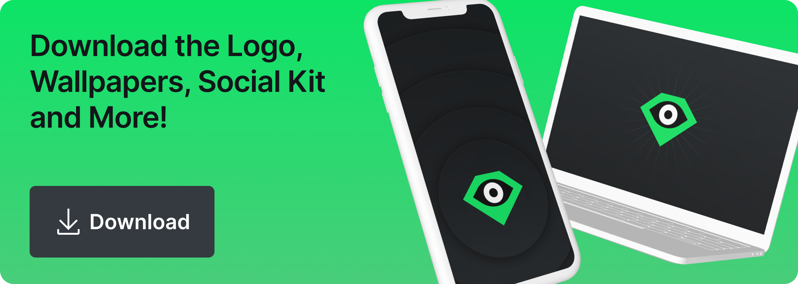](/assets/files/LooksRare_Brand_Assets-80a8b0b48d179bf6d125153317325c95.zip)

This ZIP file contains:

- LooksRare logos
- Device wallpapers / brand images
- A community social media kit so you can rep the project on Discord, Twitter, Instagram... and other NFT marketplaces!

**[💾 Download the Assets](/assets/files/LooksRare_Brand_Assets-80a8b0b48d179bf6d125153317325c95.zip)**

---

## Intro

LooksRare is pretty open minded and flexible with our icon, but not our name.

We encourage creators to make derivative artworks based on the icon, and tbh we wanna see the community get real weird with it. If you’re selling derivative works, please give attribution and make sure you follow the guidelines here carefully so we don’t have a disagreement. If it’s dope, @ us on social so we don't miss it!

**BUT**, our logo and name are important, copyrighted parts of our brand, and we must protect them. So let’s go over a few ground rules.

## What Can I Do?

### ✅👌🙂 You may:

- ✅ Recreate, remix, create derivative artworks featuring **the diamond icon**, with attribution.
- ✅ Buy and sell said derivatives, if you give attribution.

### 🚫😰👎 You may not:

- 🚫 Use our Brand Assets (logo, icon, name,) or any derivative works in any product/brand name, brand logo, etc. that can conflict or compete with LooksRare. For example:
  - Don’t make an NFT marketplace called “LooksExpensive”
  - Don’t make a digital art brand or product with a similarly-shaped diamond logo with an eye, even if it’s colored yellow or something.
  - Don’t make a product called “LooksRare Tools” or similar that may be misinterpreted as having an official relationship to LooksRare.
- 🚫 Use or remix any of our Brand Assets to imply an official relationship, partnership, or other endorsement where there is none.
- 🚫 Use the name “LooksRare” in full in social media channels in a way that implies any official relationship to us. If you make a fan group, Twitter account etc., make it clear that it’s not official.
- 🚫 Falsely claim or suggest any sort of official relationship, partnership, or other endorsement in any way.

If in doubt, reach out to [\[email protected\]](/cdn-cgi/l/email-protection#5034352339373e103c3f3f3b23223122357e3f2237)

## Logo Guidelines

### Logo Anatomy

- A. **Logotype**
  - The type is set in Inter, but never recreate it - just use the SVG or PNG provided.
- B. **Icon**
  - Watches you while you paperhand your JPEGs.
- C. **Logo** (horizontal lockup)
  - The logotype and icon combine to make The Logo. Always use them in this exact proportion. 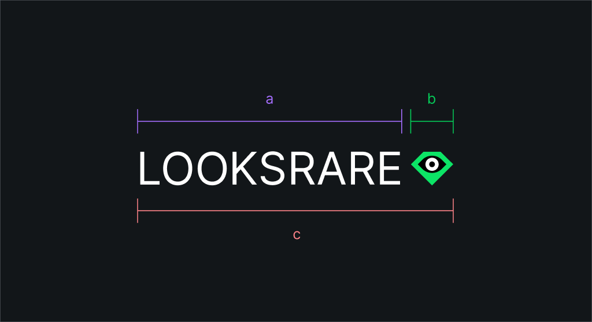

### Logo Variations

- A. **Icon**
  - Can be used on its own to represent LooksRare or LOOKS.
- B. **Horizontal logo lockup**
  - This is the primary logo.
- C. **Vertical logo lockup**
  - Only use this one when you have to display our logo with other similar shaped logos.
- D. **LOOKS Token**
  - When you’re representing the token, please use the diamond-eye icon on a circular green background. Don’t use a square shape for the token. 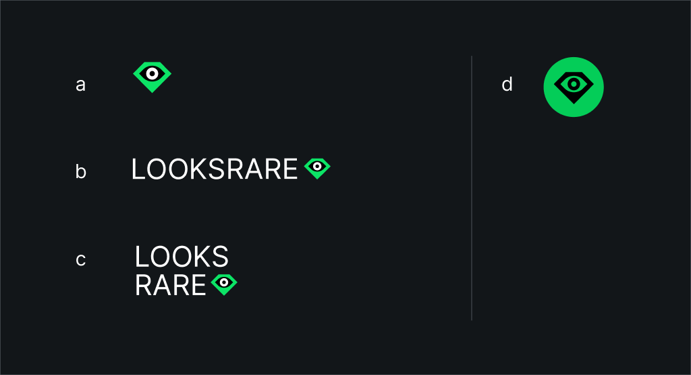

### Logo Clear Space

Give the logo breathing room. Keep a space around the logo that's equal to at least the width of the diamond icon (x) on all sides.

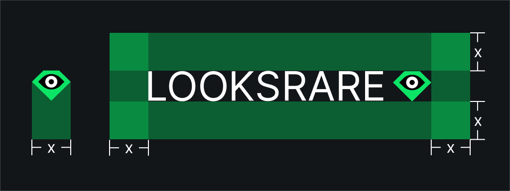

Use the icon on the green circular background to represent LOOKS token.

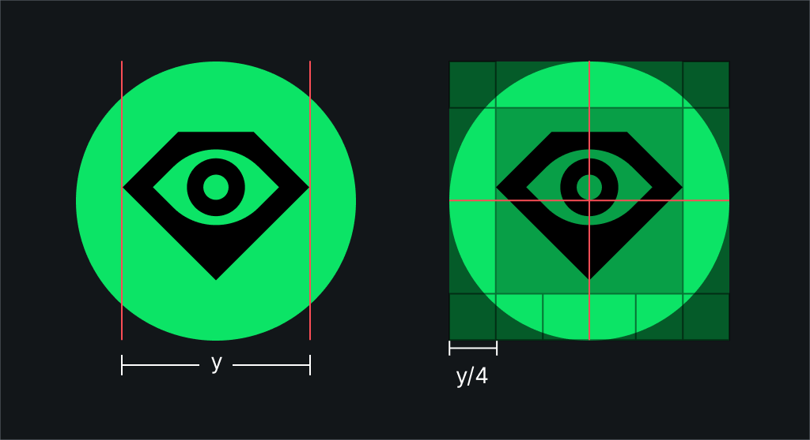

The downloadable assets have the correct proportions already, but anyway: the clear space around the diamond icon must be at least 1/4 the width of the icon (y/4).

## Logo Colors

Green is LooksRare’s brand color. It’s vibrant, saturated, slightly acidic, and generally stands out because it’s great. We like the green.

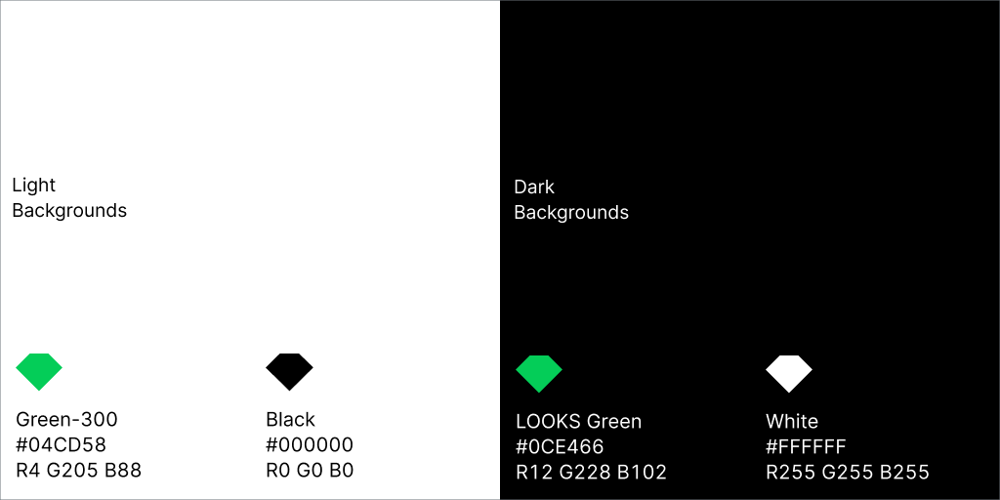

**When you’re using our logos, never adapt or recolor the files manually: just use the correct version for your use case.** This detail is just for your reference.

### Logos on background colors

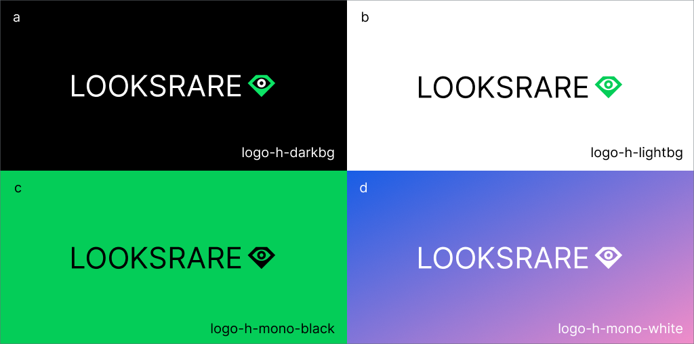

Make sure the logo and icon are always fully visible against the background. Use the correct version for your use case.

- a, b: Use the “lightbg” and “darkbg” logos on monochrome backgrounds
- c, d: Use the “mono” logos on colored backgrounds

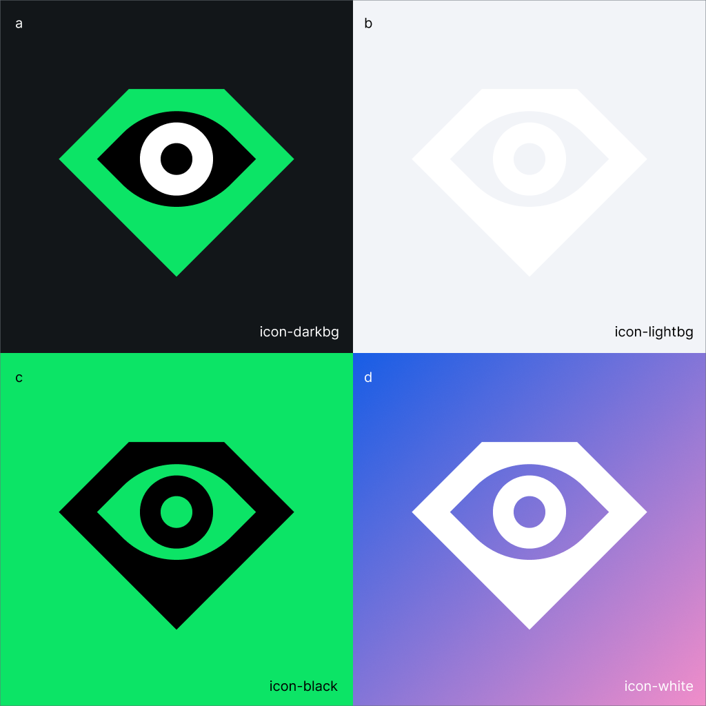

We use a different shade of green on different backgrounds, and a different version of the icon.

On light backgrounds, and especially at small scale the two-colored "darkbg" icon is hard to see; that's why we use the all-green "lightbg".

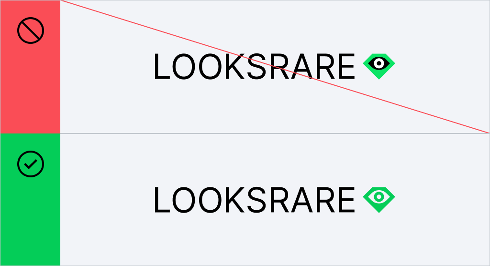

### Logo Restrictions

Common sense stuff really.

- Don’t move the icon to the left
- Don’t remove the icon
- Don’t change the text color
- Don’t break up the name in the horizontal lockup (vertical lockup is unavoidable)
- Don’t add drop shadows or distort the text
- Don’t add outlines or other effects
- Don’t change the typeface or otherwise reconstruct the logo

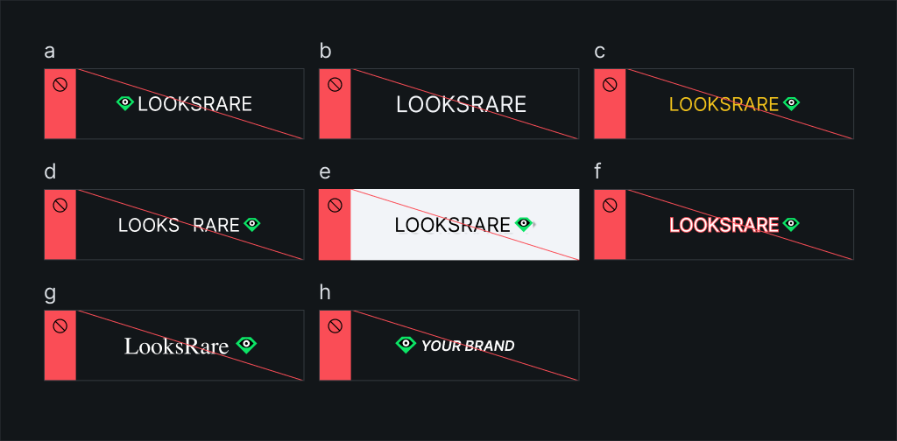

When you’re putting our logo next to another logo, make sure it has similar visual weight (size) to the other. You can use the vertical logo lockup if you need to fit the logo into a tighter space. 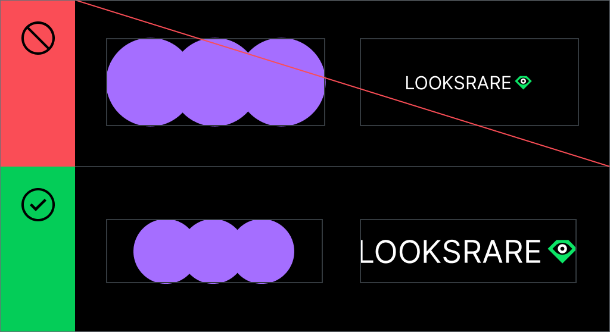

### Flexibility

OK, we just got through some examples of what not to do, but the logo system is built for flexibility. Play around and replace the OO or diamond icon as you like to tell a story. Show us what you got.

**Get weird.** 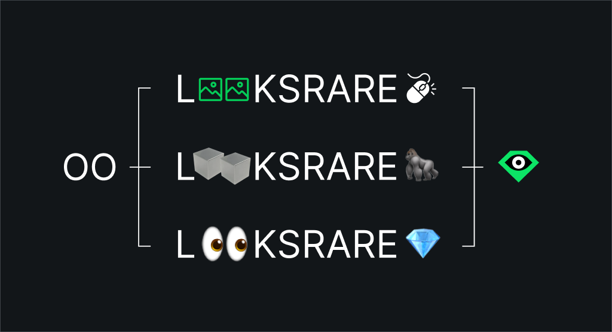

Again, if you’ve got any questions, shoot us an email at [\[email protected\]](/cdn-cgi/l/email-protection#b5d1d0c6dcd2dbf5d9dadadec6c7d4c7d09bdac7d2)
