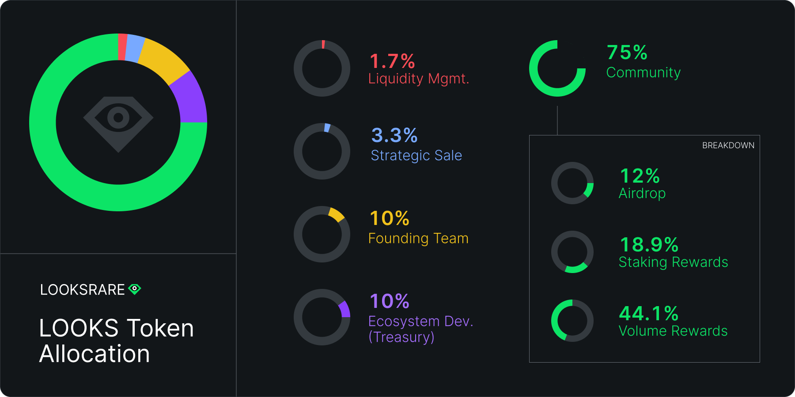
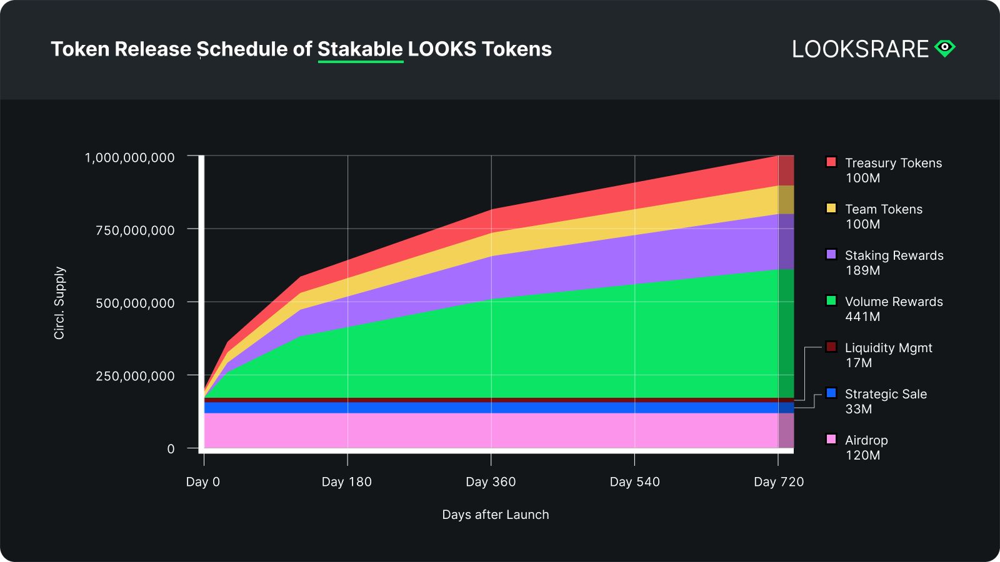
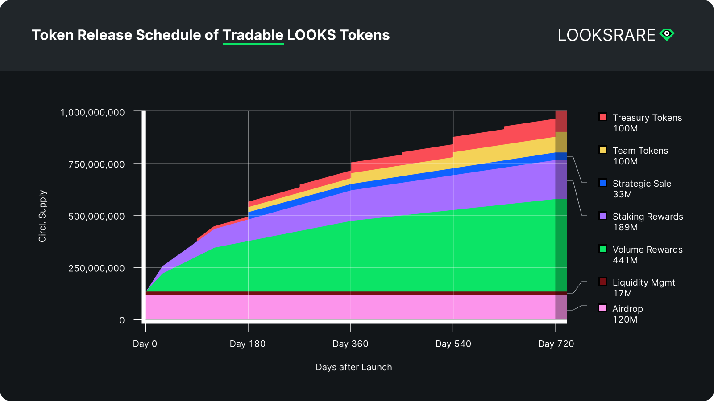

## LOOKS allocation

|                          | Percentage of supply | Total LOOKS       |
| ------------------------ | -------------------- | ----------------- |
| **Airdrop**              | 12%                  | 120,000,000       |
| **Strategic Sale**       | 3.3%                 | 33,083,003        |
| **Liquidity Management** | 1.7%                 | 16,916,997        |
| **Volume Rewards**       | 44.1%                | 441,000,000       |
| **Staking Rewards**      | 18.9%                | 189,000,000       |
| **Founding Team**        | 10%                  | 100,000,000       |
| **Treasury**             | 10%                  | 100,000,000       |
| **Total Supply**         | **100%**             | **1,000,000,000** |

## LOOKS emission schedule

### Release schedule of stakable LOOKS

### Release schedule of tradable LOOKS

### Update to Team / Treasury Fund Management

`Update Feb 4, 2022`

During the initial setup of the Team and Treasury tokens, there was an oversight in the amount of Pre-minted LOOKS tokens sent to the respective wallets.

- The Team vesting contract ([0x332580e0da5b5072ff5d5b73a494a65bb99744d8](https://etherscan.io/address/0x332580e0da5b5072ff5d5b73a494a65bb99744d8)) was meant to receive 20M LOOKS tokens, but instead received 10M LOOKS: [https://etherscan.io/tx/0xf5a003b5a82afd39d2f8d1466b7b670e4d821adce4502de62de2ed36360ef367](https://etherscan.io/tx/0xf5a003b5a82afd39d2f8d1466b7b670e4d821adce4502de62de2ed36360ef367)
- The Treasury vesting contract ([0x6757f73cddf4c16171281ff869e620c6ce30e12b](https://etherscan.io/address/0x6757f73cddf4c16171281ff869e620c6ce30e12b)) was meant to receive 10M LOOKS tokens, but instead received 20M LOOKS: [https://etherscan.io/tx/0x5f90fa71e3b631d497739aede84b48d3a51c5a918c342b4a4108f1bc3f0024e2](https://etherscan.io/tx/0x5f90fa71e3b631d497739aede84b48d3a51c5a918c342b4a4108f1bc3f0024e2)

While **this does not affect the current vesting schedule for team and treasury tokens**, it does mean we will need to make a final adjustment at the end of the 721 day LOOKS emission period, as the Team wallet address will end up with 90M LOOKS and the Treasury wallet will end up with 110M LOOKS, when it should be 100M for each.

An immediate impact is that the WETH fee sharing amount that is distributed to the Team and Treasury address each day is affected. i.e. The Treasury will receive more WETH than intended and the Team will receive less WETH than intended. To resolve this, we will continue to make periodic adjustments to the Team and Treasury WETH balances by transferring between the two, so that each address receives the WETH that it should have received if the oversight mentioned above had not occurred. An example of this can be seen in this transaction, where we transferred **3,850** WETH from the Treasury multi-sig wallet to the Team multi-sig wallet: [https://etherscan.io/tx/0x0dee1d14528431ce44d7d70fe758f0b1fb3fa05025ebc1ca36f82592c5b0d6d5](https://etherscan.io/tx/0x0dee1d14528431ce44d7d70fe758f0b1fb3fa05025ebc1ca36f82592c5b0d6d5)

- Team vesting contract [0x332580e0da5b5072ff5d5b73a494a65bb99744d8](https://etherscan.io/address/0x332580e0da5b5072ff5d5b73a494a65bb99744d8)
- Team multisig safe [0xF6aF7dA33f86F138Cc7DBE3a970De1905Da5d1E8](https://etherscan.io/address/0xF6aF7dA33f86F138Cc7DBE3a970De1905Da5d1E8)
- Treasury vesting contract [0x6757f73cddf4c16171281ff869e620c6ce30e12b](https://etherscan.io/address/0x6757f73cddf4c16171281ff869e620c6ce30e12b)
- Treasury multisig safe [0xC8C57e4C73c71f72cA0a7e043E5D2D144F98ef13](https://etherscan.io/address/0xC8C57e4C73c71f72cA0a7e043E5D2D144F98ef13)
